# 🚀 Olabs Hackathon Project - Lazy Lizards

## 🏆 Team Lazy Lizards
- **Rohith Varma Datla** - Backend Development 📱
- **Aadarsh Prajapati** - Full-Stack Development 💻
- **Priti Gupta** - Frontend Development 🎨
- **Anudeep** - Mobile Development 📲

---

## 🌍 Theme: **Collaborative Learning & Olabs Development**

### 📌 Problem Statement: **Advancing Real-Time Collaboration with AI**
>We are enhancing live collaboration with real-time whiteboards, screen sharing, and video conferencing, while also integrating AI-powered chatbots, quizzes, and language translation using the Gemini API.

 ### 📌 Problem Statement:**Inconvenient Access to Learning Tools on Mobile**
 > Students face difficulty accessing coding and ML tools on mobile without downloads. Our Flutter-based app provides full access to live code editors and ML visualizers on both Android and iOS.

🚀 **Solution Highlights:**
- Live whiteboard, screen sharing, calling, AI chatbot for role-based training
- Custom quizzes using **Gemini API** 🤖
- **Web Development & Machine Learning** with live code editors and ML algorithm visualizer
- **Built with Flutter** for seamless cross-platform support (Android & iOS)
- Aligned with the latest **CBSE syllabus** 📚

---

## 🛠 Features Built

### 🔹 **Real-time Collaboration Tools**
✔️ Video & Audio Calling 📞🔊
✔️ Whiteboard for collaborative learning ✏️🖥️
✔️ AI chatbot for **instant doubt resolution** 🤖💡

### 🔹 **Skill Development Section**
✔️ Covers the **latest NCERT syllabus** (Up to Class 12) 📖
✔️ **Web Development Module** - Theory, Procedures, Text Editor, Quizzes, Resources 🖥️
✔️ Interactive **Feedback Mechanism** 📢

### 🔹 **Olabs Mobile App Prototype**
✔️ Designed for students in **rural areas** 🏡🌏
✔️ No downloads required, **runs with low internet bandwidth** 📶

### 🔹 **Machine Learning Visualizers**
✔️ **Linear Regression** animated visualizer 📊
✔️ **Logistic Regression** easy-to-understand animations 🤖

### 🔹 **Olabs Mentor AI Chatbot**
✔️ Integrated **Gemini API** to clarify student doubts instantly 🚀
✔️ Available **directly on Olabs platform** 🏫

---

## 🔧 Tech Stack
- **Flutter** 🦋 - Cross-platform mobile development
- **Dart** 🎯 - Backend logic
- **Gemini API** 🤖 - AI-powered chatbot
- **ReactJS** ⚛️ - Frontend web development
- **Tailwind CSS** 🎨 - Styling & UI design
- **ExpressJS** 🔥 - Backend & database

---

## 🎯 Future Scope
📌 **Gamification** of learning with rewards & badges 🏆
📌 **AI-powered interactive courses** with adaptive difficulty 🤖
📌 **More ML visualizers** for deeper understanding 🔬

---

## 📸 Screenshots & Demo
### 🔹 Web Interface
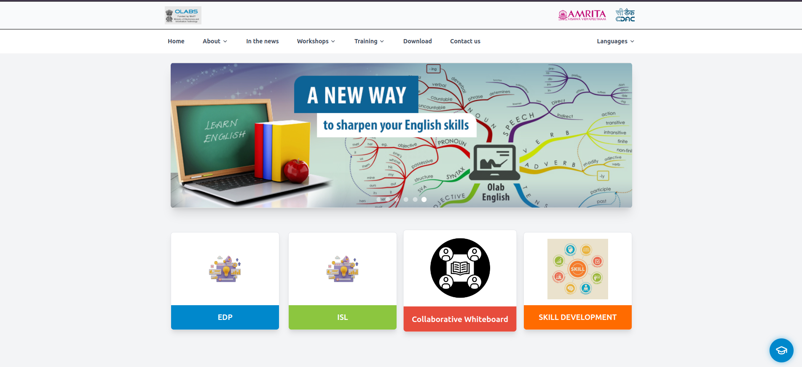
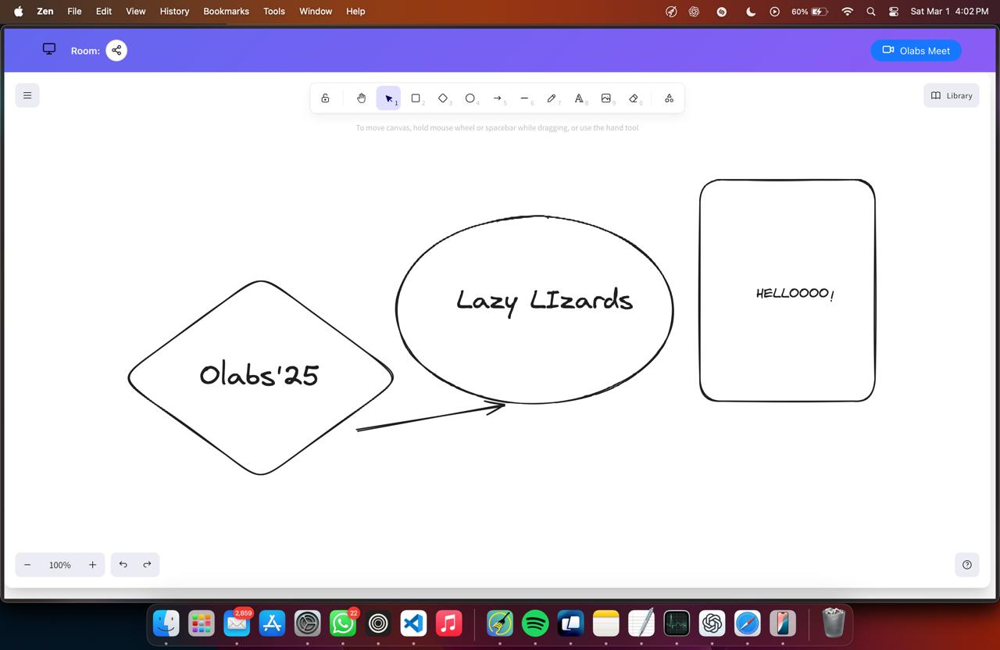
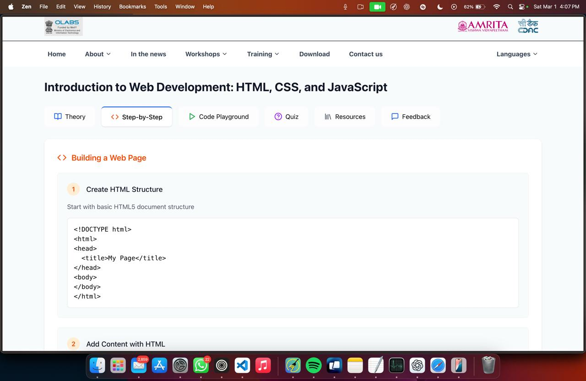
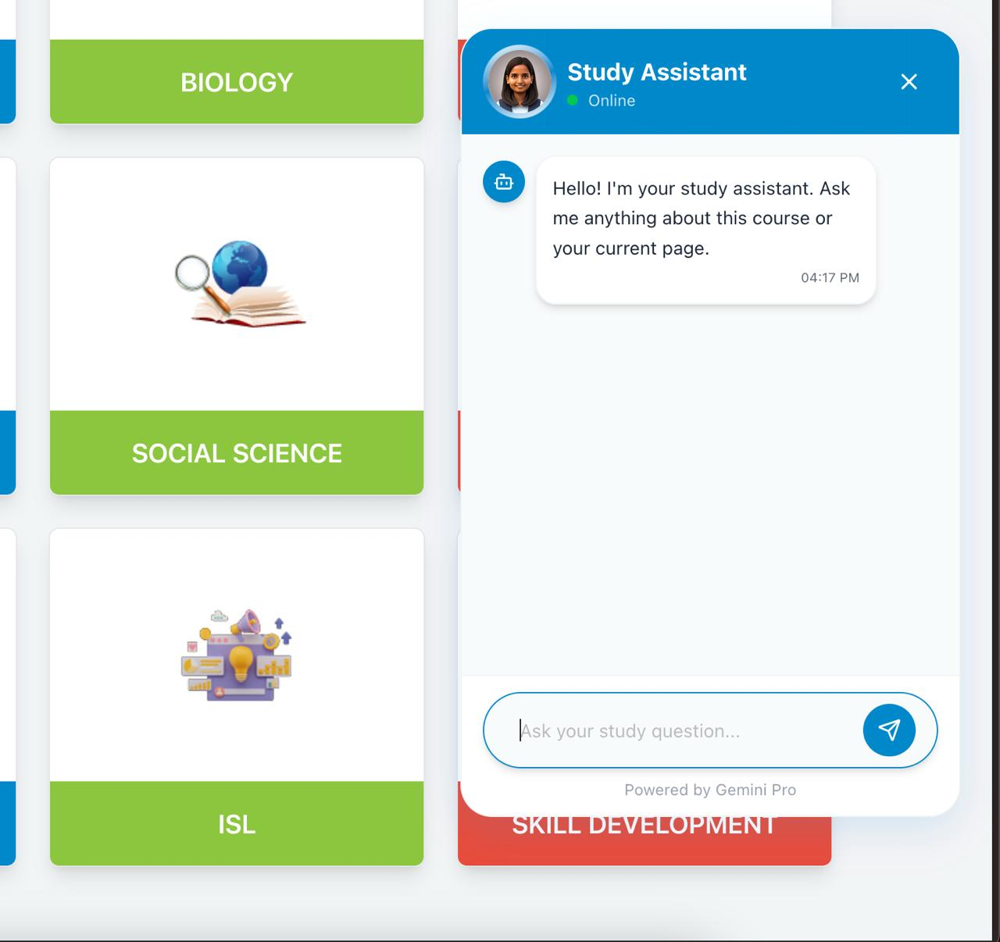
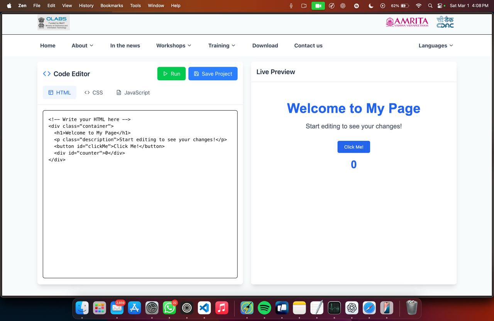
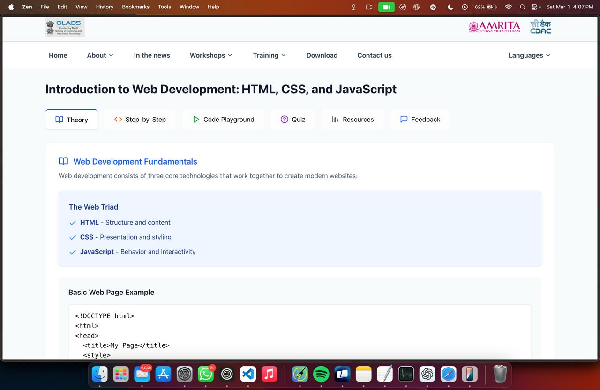
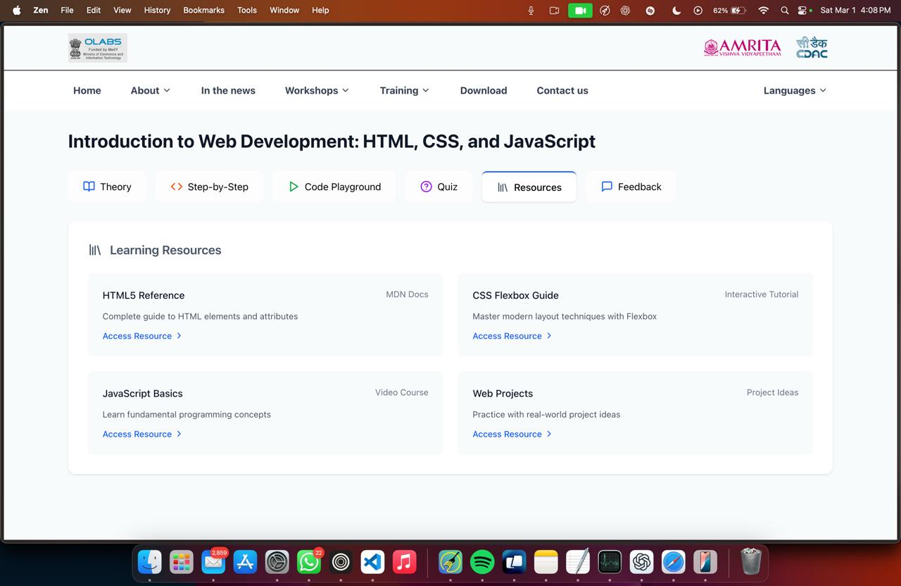
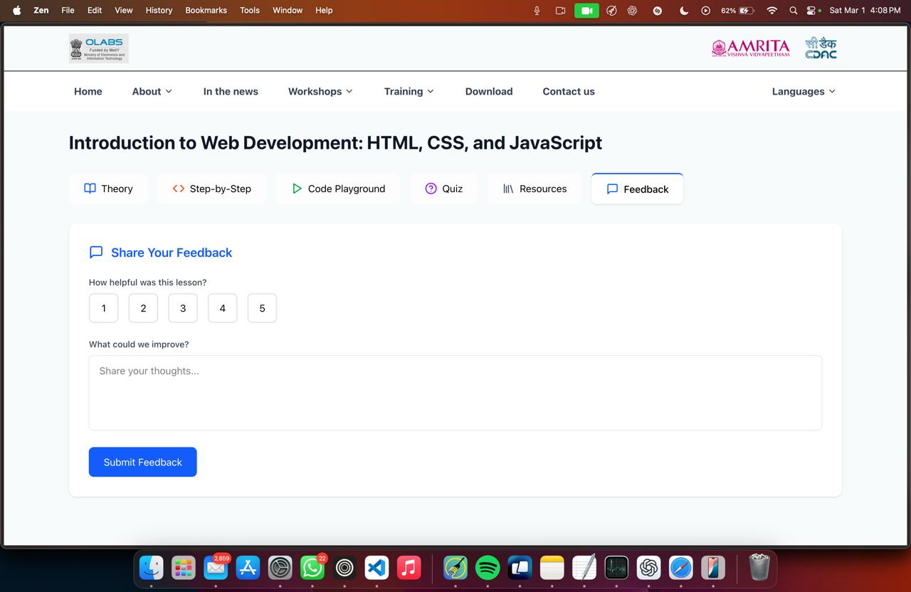
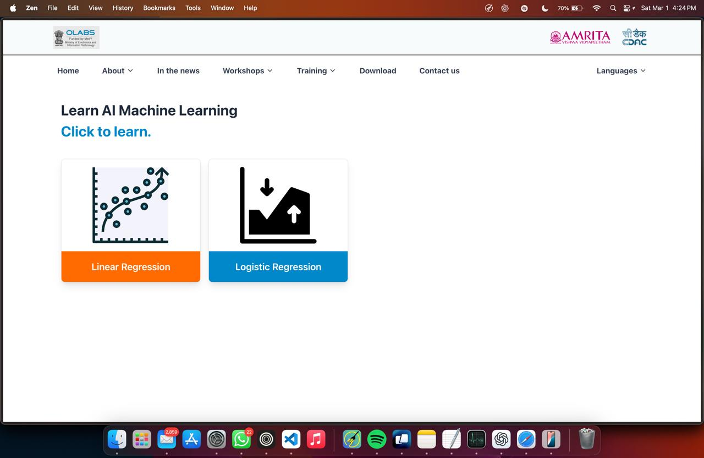
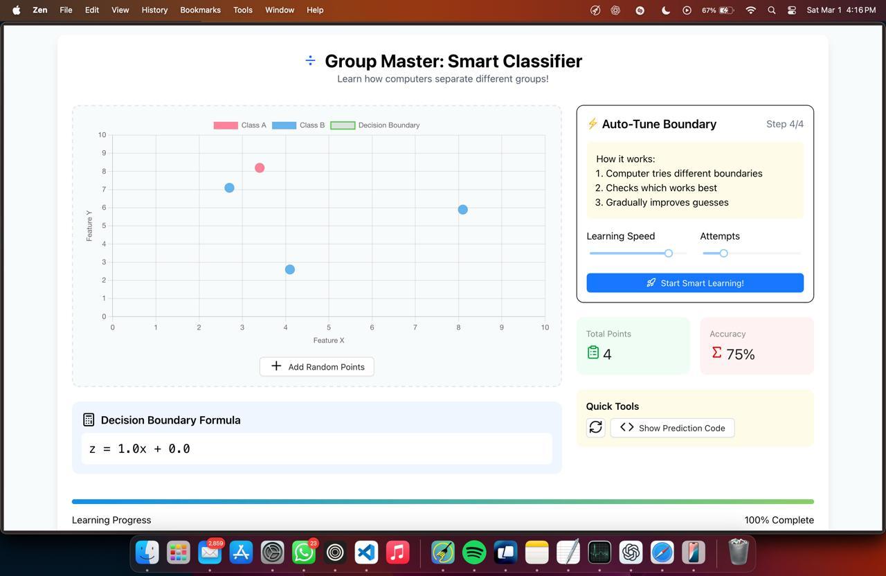
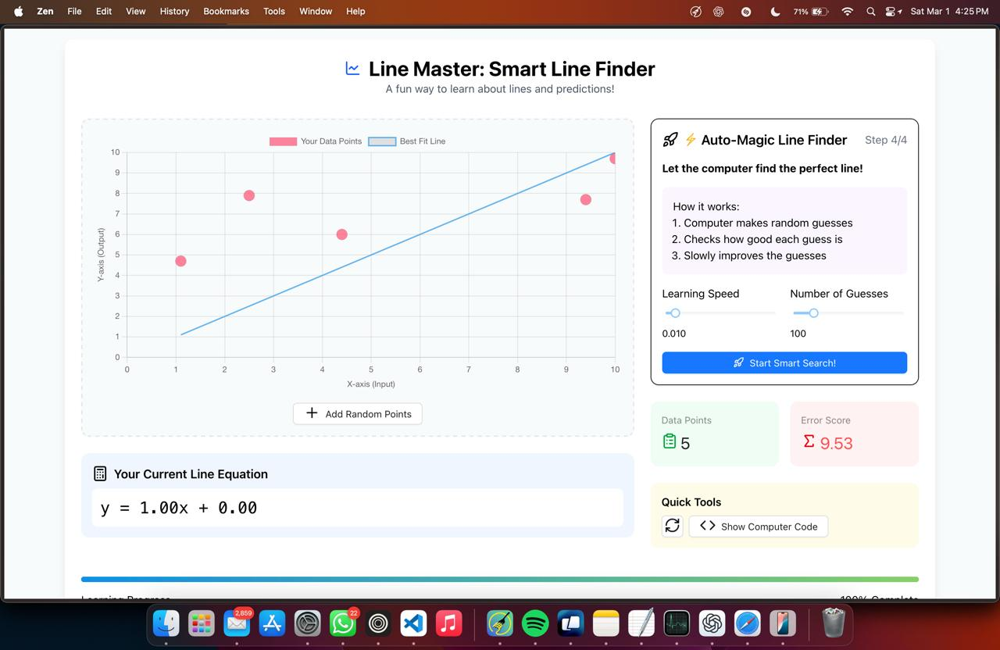
### 🎥 Real-Time Collaboration Video
[![Watch Video]](public/screenshots/realtimeColab.mp4)


## 💡 How to Run the Project
1. Clone the repository:
   ```bash
   git clone https://github.com/your-repo/olabs-project.git
   ```
2. Navigate to the project folder:
   ```bash
   cd olabs-project
   ```
3. Install dependencies:
   ```bash
   flutter pub get
   ```
4. Run the app:
   ```bash
   flutter run
   ```

---

## 🤝 Contributing
We welcome contributions! Feel free to open an issue or submit a PR.

---

## 🔗 Related Repositories
- **Backend Repository:** [Olabs Backend](https://github.com/Aadarshprajapati777/olabs-backend)
- **Mobile App Repository:** [Olabs Mobile App](https://github.com/anudeep2710/Olabs-Hack)


## 📬 Contact Us
✉️ **Lazy Lizards** - [geekaadarsh.dev@gmail.com]

📌 _Made with ❤️ for the Olabs Hackathon 2025_ 🎉

